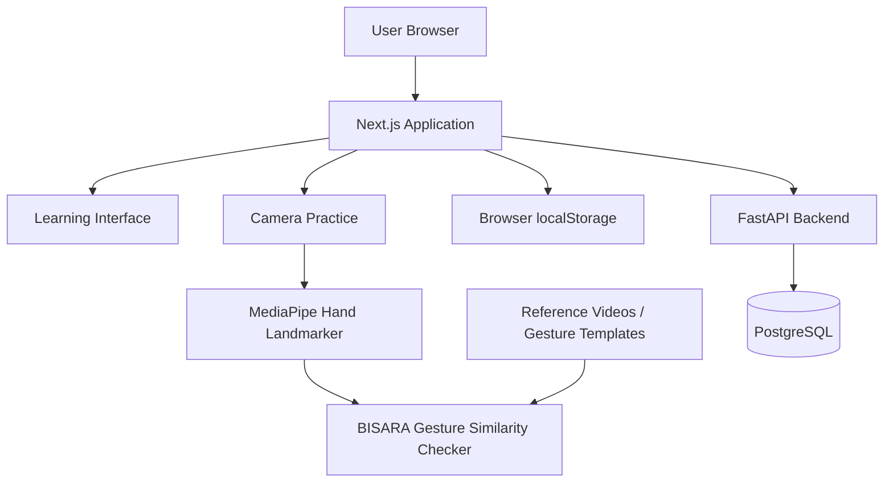

# BISARA

**Learn to communicate, not just memorize signs.**

BISARA is a web-based BISINDO learning platform that provides structured sign-language learning, camera-based gesture practice, recognition exercises, and learning progress tracking.

---

## Technology Stack

| Layer | Technology | Purpose |
|---|---|---|
| Frontend | Next.js | Web application framework |
| UI | React | Interactive user interface |
| Language | TypeScript | Type-safe frontend development |
| Computer Vision | MediaPipe Hand Landmarker | Hand landmark extraction from reference and camera input |
| Gesture Evaluation | Custom similarity-based gesture checker | Compares learner gestures with target references |
| Backend | FastAPI | Authentication and learning-progress API |
| Backend Language | Python | Backend application logic |
| Database | PostgreSQL | Persistent account and progress storage |
| Guest Storage | Browser `localStorage` | Progress persistence without an account |
| Infrastructure | Docker / Docker Compose | Backend and database environment |

---

## Technical Documentation

### System Architecture

BISARA separates the learning interface, gesture processing, and persistent user data.



The frontend is responsible for the learning experience and browser-side gesture analysis.

Guest learning progress is stored locally in the browser.

For registered users, account and progress data are handled through the FastAPI backend and PostgreSQL database.

---

### Gesture Checker

BISARA uses a **target-specific gesture similarity checker** for camera-based sign practice.

The checker is not a trained multi-class BISINDO classifier.

MediaPipe is used to extract hand landmarks, while BISARA's own gesture-evaluation logic compares the learner's movement against the expected reference.

#### Processing Flow

```text
Reference Gesture
       │
       ▼
Reference Hand Landmarks
       │
       │
       ├─────────────────┐
       │                 │
       │             User Camera
       │                 │
       │                 ▼
       │        MediaPipe Hand Landmarker
       │                 │
       │                 ▼
       │        User Landmark Sequence
       │                 │
       └────────┬────────┘
                ▼
        Landmark Processing
                │
                ▼
       Gesture Comparison
                │
        ┌───────┼────────┐
        │       │        │
   Handshape Movement Orientation
        │       │        │
        └── Position / Coordination
                │
                ▼
             Feedback
```

The gesture evaluation may consider several components of a sign, including:

- handshape;
- movement;
- orientation;
- position;
- coordination for signs involving multiple hands.

Reference gesture data can be preprocessed into reusable landmark templates so the same reference video does not need to be processed repeatedly during practice.

### Role of MediaPipe

MediaPipe Hand Landmarker provides the hand-landmark representation used by the application.

```text
MediaPipe
→ extracts hand landmarks

BISARA
→ processes and compares those landmarks
→ evaluates similarity to the target sign
→ provides practice feedback
```

MediaPipe itself does not determine the linguistic correctness or meaning of a BISINDO sign.

---

### Database & Progress

BISARA supports both guest and registered-user learning progress.

#### Guest Mode

```text
BISARA
   │
   ▼
Browser localStorage
   │
   ▼
Local learning progress
```

Guest users can use the learning experience without creating an account.

Their progress is persisted locally in the browser.

#### Registered User Mode

```text
Next.js
   │
   ▼
FastAPI
   │
   ▼
PostgreSQL
```

Registered-user data is persisted through the backend.

The backend currently handles data related to:

- `users` — registered user accounts;
- `user_progress` — persistent learning progress;
- `auth_sessions` — authentication sessions.

Learning media such as reference videos and gesture templates are application assets rather than user-progress records stored in PostgreSQL.

---

## Installation & Usage

### Prerequisites

Install the following tools before running BISARA locally:

- Node.js
- npm
- Docker
- Docker Compose

---

### 1. Clone the Repository

```bash
git clone <REPOSITORY_URL>
cd BISARA
```

Replace `<REPOSITORY_URL>` with the BISARA GitHub repository URL.

---

### 2. Install Frontend Dependencies

```bash
npm install
```

---

### 3. Start Backend and Database Services

BISARA uses Docker Compose for its backend/database environment.

```bash
docker compose up -d --build
```

---

### 4. Start the Web Application

```bash
npm run dev
```

The development application can then be opened at:

```text
http://localhost:3000
```

---

### 5. Production Build

To verify the production build:

```bash
npm run build
```

---

### Environment Configuration

If environment variables are required by the current deployment or backend configuration, configure them using the provided environment example/configuration files.

Do not commit:

- database credentials;
- API secrets;
- authentication secrets;
- production passwords;
- private environment values.

---

## Third-Party Resources & Attribution

BISARA uses third-party datasets and open-source technologies for learning references and hand-landmark processing.

The original resources remain subject to their respective licenses.

---

### WL-BISINDO

**Resource:**  
WL-BISINDO

**Associated publication:**  
*Word-Level BISINDO: A Novel Video Indonesian Sign Language Dataset and Baseline Methods*

**Authors:**  
Grace Oktaviani Kindy, Glenn Leonali, and Henry Lucky

**Publication:**  
Procedia Computer Science, Volume 269, 2025, pp. 249–258

**DOI:**  
`10.1016/j.procs.2025.08.277`

**Source:**  
GitHub — `AceKinnn/WL-BISINDO`

**License:**  
Creative Commons Attribution-NonCommercial 4.0 International  
**CC BY-NC 4.0**

WL-BISINDO contains 1,600 RGB videos covering 32 isolated BISINDO signs performed by five signers and focuses on the Banten regional variant.

BISARA uses selected WL-BISINDO resources as word-level sign references and for derived hand-landmark reference templates used by the gesture-practice system.

BISARA does not claim ownership of the original WL-BISINDO dataset.

---

### Indonesian Sign Language Dataset: Alphabet Video

**Resource:**  
*Indonesian Sign Language Dataset: Alphabet Video*

**Contributor:**  
Indah Siradjuddin

**Institution:**  
Universitas Trunojoyo Madura, Faculty of Engineering, Informatics Department

**Published:**  
22 January 2024

**Version:**  
1

**DOI:**  
`10.17632/p7j5jrsbbb.1`

**Source:**  
Mendeley Data — dataset ID `p7j5jrsbbb`

**License:**  
Creative Commons Attribution 4.0 International  
**CC BY 4.0**

The dataset contains video samples for the 26 alphabet letters in Indonesian Sign Language.

BISARA uses selected videos from this dataset as reference material for alphabet learning.

Where required for browser compatibility, selected source videos may be transcoded into a web-compatible video format without intentionally altering the sign content.

BISARA does not claim ownership of the original dataset.

---

### MediaPipe

**Resource:**  
Google MediaPipe / MediaPipe Hand Landmarker

**Maintainer:**  
Google

**Source:**  
Google AI Edge MediaPipe

**License:**  
Apache License 2.0

BISARA uses MediaPipe Hand Landmarker to extract hand landmarks from visual input during gesture practice.

MediaPipe provides landmark detection only. Target-specific gesture comparison and learning feedback are implemented by BISARA.

---

## License Compliance

Third-party datasets, software, and media used by BISARA remain subject to their respective licenses.

In particular:

- **WL-BISINDO** is used under **CC BY-NC 4.0**;
- **Indonesian Sign Language Dataset: Alphabet Video** is used under **CC BY 4.0**;
- **MediaPipe** is used under the **Apache License 2.0**.

BISARA's use of these resources does not imply endorsement by their original authors, contributors, institutions, or maintainers.
