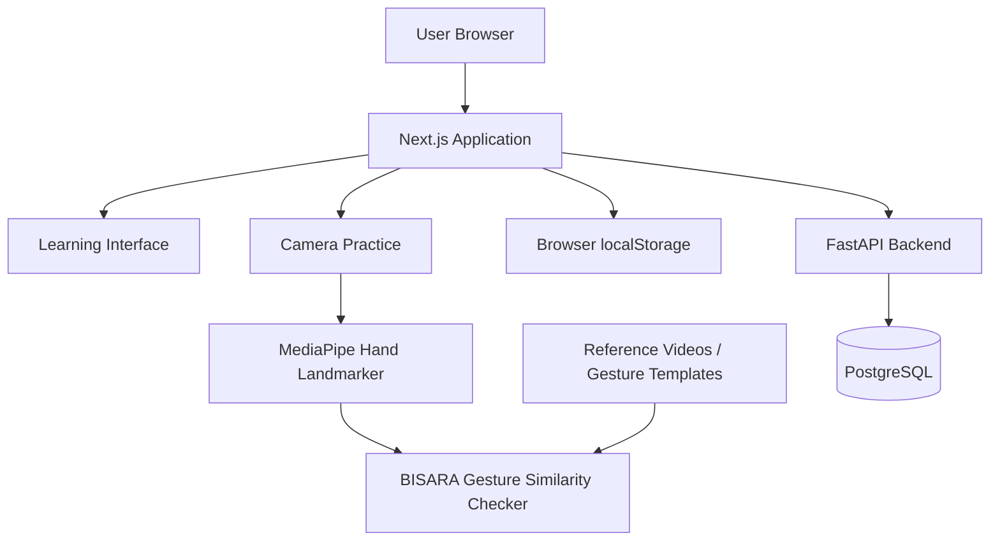

# BISARA

BISARA is a gamified BISINDO learning platform focused on practical, real-world
communication. Learners observe signs, imitate with camera feedback, test
recognition, and perform signs from memory without an example.

## Current learning flow (September 2026)

- The active curriculum has 5 chapters and 25 missions: 20 missions for all 32
  word-level signs, followed by 5 alphabet missions covering A–Z.
- Required flow: **Amati → Tirukan → Uji pengenalan → Uji peragaan**.
  After all signs pass camera practice and recognition reaches at least 70,
  learners perform each mission sign from memory with the camera checker before
  the next mission unlocks. Checkpoints test a fixed sample of 6–8 signs from
  the chapter rather than all 32 signs in the final checkpoint.
- **Uji peragaan** shows a word and keeps the reference video hidden during
  capture. Each passing sign is saved independently, so users resume where they
  stopped. Poor detection is not counted as an incorrect gesture. A learner can
  return to Tirukan to view the example, then retry the test without an example.
- **Review** still offers self-reported recall with optional help and spaced
  repetition. These review reports cannot complete a mission.
- Review returns learned words when due, up to 5 a day. Independent recall on
  separate days grows intervals through 1/3/7/14/30 days; help or difficulty
  schedules tomorrow. First daily recall per word earns 10 XP; repeated clicks
  do not increase spacing or award the same daily XP again.
- Existing completion records are preserved. Previously finished missions stay
  unlocked; a newly passed recognition test alone no longer records mission
  completion. Legacy `mode=context` and `mode=conversation` links open recall.
- Important files: `lib/learning-progress.ts` (mission gates),
  `lib/progress-storage.ts` (completion and recall scheduling),
  `components/mission-assessment.tsx` (recognition),
  `components/production-test.tsx` (camera-based final test),
  `components/recall-practice.tsx` (self-assessed spaced review), and
  `components/review-quest.tsx` (due review queue).
- Recall history and per-mission production passes live in optional
  `signMastery[id]` fields. The API schema accepts these in the existing JSONB
  column; no database migration is required. Restart/rebuild the API before
  syncing the new production pass field.
- Chapter 5 teaches A–Z from one selected video per letter. Tirukan and Uji
  peragaan now use a local hand-landmark checker that compares finger shape,
  orientation, and, for two-hand letters, the relationship between hands.
  Either signing hand can be used. A letter must pass before the learner advances.
  Three reference templates per letter are precomputed from the supplied dataset;
  the checker also compares with other letters before accepting an attempt.
  J requires a visible vertical sweep; Z's full path is not gated because its
  clips do not isolate a consistent motion cycle. This prototype has not been validated as a BISINDO
  classifier; camera accuracy and signing variation still need user testing.
  The existing completed mission IDs store progress without a new database table.

The milestones below describe earlier iterations; the current flow above
supersedes their scenario-completion and review requirements.

## Implemented milestones

### Milestone 1 — Product foundation

- BISARA visual system and application shell
- learning dashboard
- active mission card
- daily review quest
- three-chapter learning journey
- responsive layout and accessible navigation

### Milestone 2 — Mission journey

- reusable application header and curriculum data model
- complete three-chapter mission list
- mission completion, active, and locked states
- mission-detail page for “Berkenalan dengan teman baru”
- learning objectives, vocabulary scope, stages, and scenario preview
- explicit Banten regional and isolated-sign prototype boundaries

### Milestone 3 — Camera practice foundation

- real browser camera permission flow
- clear idle, loading, ready, denied, unavailable, and error states
- live MediaPipe Hand Landmarker inference for up to two hands
- live MediaPipe Pose Landmarker inference for shoulder and torso anchors
- 21-point landmark overlay for each detected hand
- camera, lighting, and hand-visibility calibration checks
- local video-frame processing with explicit privacy messaging
- honest separation between landmark detection and BISINDO correctness scoring

### Milestone 4 — Chapter test and conversation flow

- five-question sign-to-text comprehension test using real WL-BISINDO samples
- answer review shown only after the complete test
- deterministic 0–100 score and zero-to-three-star rating
- 50-point chapter-unlock threshold
- repeatable attempts with the best score retained during the active session
- three-turn branching conversation simulation
- explicit pending state for camera-response scoring
- dataset attribution stored beside every included media sample

### Milestone 5 — Progress, badges, streaks, and review

- browser-local progress store shared across the application
- persistent XP, streak, best score, test attempts, and conversation completions
- responsive progress dashboard with a weekly activity chart
- Recognize, Imitate, and Communicate mastery indicators
- unlocked and locked badge collection
- five-item daily review quest with live XP updates
- test and conversation results connected to the progress dashboard

### Milestone 6 — Accounts and server progress

- FastAPI backend with PostgreSQL and versioned Alembic migrations
- registration, login, session recovery, and logout at `/account`
- Argon2 password hashing and revocable HttpOnly cookie sessions
- session-bound CSRF validation and explicit origin checks
- account-specific browser cache and automatic progress synchronization
- stale-write protection with an explicit conflict-resolution flow
- optional guest import into a new account
- isolated API tests and frontend sync regression tests

New accounts start at zero. Guest mode preserves the prototype's seed values.
Account data is stored in PostgreSQL and can be restored after login in another
browser connected to the same server. BISINDO classification and validated
corrective feedback remain planned work.

### Camera similarity checker

Camera practice compares a recorded attempt with the selected sign's
demonstration using hand landmarks and DTW. The 32 reference templates are
precomputed from the 32 local videos and fetched once, so passing attempts can
also be compared against every other curriculum sign without decoding 32
videos during practice. It matches stable left/right hand identities,
normalizes mirrored hand geometry, and resamples both sequences on normalized
time so sampling rate and overall speed do not determine the movement score.
Movement compares the ordered, centered wrist path instead of noisy
frame-to-frame derivatives. Handshape and orientation use the visible 2D hand
skeleton so MediaPipe depth errors caused by camera angle or torso occlusion do
not dominate the result. After camera activation, the selected reference video
also receives shoulder and torso landmarks. Hand position is then normalized
against the same body anchors in the learner recording, which distinguishes
head-level and chest-level signs without penalizing a whole-person shift in the
camera. Up to two detected people are considered, and the pose whose wrists
match the signing hands is selected so a bystander cannot become the body
anchor. The selected gesture window excludes relaxed
preparation frames but requires a sustained matching handshape. Two-hand
distances remain in shared image coordinates. A bounded extension-pattern
fallback absorbs unstable inner-finger landmarks when hands overlap, while a
changed or copied second hand still fails the detailed two-hand checks.

The practice flow pauses the demonstration on its first detected hand frame
during a monotonic three-second countdown. Recording and the demonstration then
start together, with the guide played at 0.75× speed. The capture window follows
the detected reference duration, allows extra reaction and final-hold time, and
runs for at least three seconds. Hand visibility remains a live readiness hint;
learners can start the countdown before raising their hands, while visibility
during the recorded gesture still affects detection quality. Timer cleanup
prevents an abandoned or restarted attempt from saving a late score.

Pose-dominant signs such as “Saya” are evaluated from a sustained stable hold,
so the incidental path used to bring a hand into or out of the camera frame does
not become the sign's required movement. Continuously moving instead of holding
the target pose is still penalized. Dynamic signs continue to use ordered-path
matching.

The pass threshold is 75. Handshape must reach 75, movement 70, and a two-hand
sign has additional checks for the second hand's shape and combined motion,
orientation, and coordination. Body-relative position must reach 60 whenever
owned pose anchors cover at least 80% of the gesture. A sufficiently severe mismatch caps the
total below the pass threshold even if other components are strong. Coordination
is excluded from one-hand totals, and a one-hand sign rejects a second hand that
remains active near the sign. At least six
usable frames spanning 400 ms are required, with 60% hand visibility for
one-hand signs or 35% for overlapping two-hand signs. Setup
and rest frames at the beginning/end are trimmed; gaps inside the gesture are
retained. “Detection quality” measures usable visibility;
MediaPipe's left/right classification confidence is not landmark accuracy.
Unusable references or missing vocabulary templates disable assessment instead
of grading the learner.

Vocabulary alternatives act as negative examples after the prompted sign has
passed. An alternative rejects the result only when it beats the prompted sign
by at least three points; tiny frame-to-frame score changes no longer contradict
an otherwise passing component panel.

For one-hand signs with a wrist sweep, the movement score checks the turn and
return on either signing hand while retaining the shape and visibility gates.
For non-contact two-hand signs, coordination uses a stable hand scale across
the recording so one foreshortened palm frame cannot distort the wrist gap.
The two supplied Keluarga camera captures pass after these corrections. A
regression test also checks hand choice, slower tempo, camera framing, and brief
tracking gaps for the 27 words outside Misi 1. To audit further local exports
without adding their landmarks to the repository, run
`npm run audit:captures -- /path/to/landmark-debug.json`.

This remains a prototype similarity checker based on one exemplar per gloss,
not a trained or validated BISINDO classifier. If stable body landmarks are not
available, position falls back to image coordinates and is removed from the
critical pass gates. Thresholds need validation with Deaf language experts and
recordings from multiple learners. Run `npm run audit:checker` for the full
32×32 exemplar comparison and altered-handshape checks; the score unit tests
live in `tests/gesture-scoring.test.ts` and
`tests/reference-templates.test.ts`.

## Tech stack

- TypeScript
- React 19
- Vinext with a Next.js-compatible application structure
- Tailwind CSS 4
- shadcn/ui
- Lucide icons
- MediaPipe Tasks Vision
- FastAPI, SQLAlchemy, Alembic, PostgreSQL

## Getting started

BISARA is a web-based BISINDO learning platform that provides structured sign-language learning, camera-based gesture practice, recognition exercises, and learning progress tracking.

---

## Technology Stack

| Layer | Technology | Purpose |
|---|---|---|
| Frontend | Next.js | Web application framework |
| UI | React | Interactive user interface |
| Language | TypeScript | Type-safe frontend development |
| Computer Vision | MediaPipe Hand Landmarker | Hand landmark extraction from reference and camera input |
| Gesture Evaluation | Custom similarity-based gesture checker | Compares learner gestures with target references |
| Backend | FastAPI | Authentication and learning-progress API |
| Backend Language | Python | Backend application logic |
| Database | PostgreSQL | Persistent account and progress storage |
| Guest Storage | Browser `localStorage` | Progress persistence without an account |
| Infrastructure | Docker / Docker Compose | Backend and database environment |

---

## Technical Documentation

### System Architecture

BISARA separates the learning interface, gesture processing, and persistent user data.



The frontend is responsible for the learning experience and browser-side gesture analysis.

Guest learning progress is stored locally in the browser.

For registered users, account and progress data are handled through the FastAPI backend and PostgreSQL database.

---

### Gesture Checker

BISARA uses a **target-specific gesture similarity checker** for camera-based sign practice.

The checker is not a trained multi-class BISINDO classifier.

MediaPipe is used to extract hand landmarks, while BISARA's own gesture-evaluation logic compares the learner's movement against the expected reference.

#### Processing Flow

```text
Reference Gesture
       │
       ▼
Reference Hand Landmarks
       │
       │
       ├─────────────────┐
       │                 │
       │             User Camera
       │                 │
       │                 ▼
       │        MediaPipe Hand Landmarker
       │                 │
       │                 ▼
       │        User Landmark Sequence
       │                 │
       └────────┬────────┘
                ▼
        Landmark Processing
                │
                ▼
       Gesture Comparison
                │
        ┌───────┼────────┐
        │       │        │
   Handshape Movement Orientation
        │       │        │
        └── Position / Coordination
                │
                ▼
             Feedback
```

The gesture evaluation may consider several components of a sign, including:

- handshape;
- movement;
- orientation;
- position;
- coordination for signs involving multiple hands.

Reference gesture data can be preprocessed into reusable landmark templates so the same reference video does not need to be processed repeatedly during practice.

### Role of MediaPipe

MediaPipe Hand Landmarker provides the hand-landmark representation used by the application.

```text
MediaPipe
→ extracts hand landmarks

BISARA
→ processes and compares those landmarks
→ evaluates similarity to the target sign
→ provides practice feedback
```

MediaPipe itself does not determine the linguistic correctness or meaning of a BISINDO sign.

---

### Database & Progress

BISARA supports both guest and registered-user learning progress.

#### Guest Mode

```text
BISARA
   │
   ▼
Browser localStorage
   │
   ▼
Local learning progress
```

Guest users can use the learning experience without creating an account.

Their progress is persisted locally in the browser.

#### Registered User Mode

```text
Next.js
   │
   ▼
FastAPI
   │
   ▼
PostgreSQL
```

Registered-user data is persisted through the backend.

The backend currently handles data related to:

- `users` — registered user accounts;
- `user_progress` — persistent learning progress;
- `auth_sessions` — authentication sessions.

Learning media such as reference videos and gesture templates are application assets rather than user-progress records stored in PostgreSQL.

---

## Installation & Usage

### Prerequisites

Install the following tools before running BISARA locally:

- Node.js
- npm
- Docker
- Docker Compose

---

### 1. Clone the Repository

```bash
git clone <REPOSITORY_URL>
cd BISARA
```

Replace `<REPOSITORY_URL>` with the BISARA GitHub repository URL.

---

### 2. Install Frontend Dependencies

```bash
npm install
```

---

### 3. Start Backend and Database Services

BISARA uses Docker Compose for its backend/database environment.

```bash
docker compose up -d --build
```

---

### 4. Start the Web Application

```bash
npm run dev
```

The development application can then be opened at:

```text
http://localhost:3000
```

---

### 5. Production Build

To verify the production build:

```bash
npm run build
```

---

### Environment Configuration

If environment variables are required by the current deployment or backend configuration, configure them using the provided environment example/configuration files.

Do not commit:

- database credentials;
- API secrets;
- authentication secrets;
- production passwords;
- private environment values.

---

## Third-Party Resources & Attribution

BISARA uses third-party datasets and open-source technologies for learning references and hand-landmark processing.

The original resources remain subject to their respective licenses.

---

### WL-BISINDO

**Resource:**  
WL-BISINDO

**Associated publication:**  
*Word-Level BISINDO: A Novel Video Indonesian Sign Language Dataset and Baseline Methods*

**Authors:**  
Grace Oktaviani Kindy, Glenn Leonali, and Henry Lucky

**Publication:**  
Procedia Computer Science, Volume 269, 2025, pp. 249–258

**DOI:**  
`10.1016/j.procs.2025.08.277`

**Source:**  
GitHub — `AceKinnn/WL-BISINDO`

**License:**  
Creative Commons Attribution-NonCommercial 4.0 International  
**CC BY-NC 4.0**

WL-BISINDO contains 1,600 RGB videos covering 32 isolated BISINDO signs performed by five signers and focuses on the Banten regional variant.

BISARA uses selected WL-BISINDO resources as word-level sign references and for derived hand-landmark reference templates used by the gesture-practice system.

BISARA does not claim ownership of the original WL-BISINDO dataset.

---

### Indonesian Sign Language Dataset: Alphabet Video

**Resource:**  
*Indonesian Sign Language Dataset: Alphabet Video*

**Contributor:**  
Indah Siradjuddin

**Institution:**  
Universitas Trunojoyo Madura, Faculty of Engineering, Informatics Department

**Published:**  
22 January 2024

**Version:**  
1

**DOI:**  
`10.17632/p7j5jrsbbb.1`

**Source:**  
Mendeley Data — dataset ID `p7j5jrsbbb`

**License:**  
Creative Commons Attribution 4.0 International  
**CC BY 4.0**

The dataset contains video samples for the 26 alphabet letters in Indonesian Sign Language.

BISARA uses selected videos from this dataset as reference material for alphabet learning.

Where required for browser compatibility, selected source videos may be transcoded into a web-compatible video format without intentionally altering the sign content.

BISARA does not claim ownership of the original dataset.

---

### MediaPipe

**Resource:**  
Google MediaPipe / MediaPipe Hand Landmarker

**Maintainer:**  
Google

**Source:**  
Google AI Edge MediaPipe

**License:**  
Apache License 2.0

BISARA uses MediaPipe Hand Landmarker to extract hand landmarks from visual input during gesture practice.

MediaPipe provides landmark detection only. Target-specific gesture comparison and learning feedback are implemented by BISARA.

---

## License Compliance

Third-party datasets, software, and media used by BISARA remain subject to their respective licenses.

In particular:

- **WL-BISINDO** is used under **CC BY-NC 4.0**;
- **Indonesian Sign Language Dataset: Alphabet Video** is used under **CC BY 4.0**;
- **MediaPipe** is used under the **Apache License 2.0**.

BISARA's use of these resources does not imply endorsement by their original authors, contributors, institutions, or maintainers.
